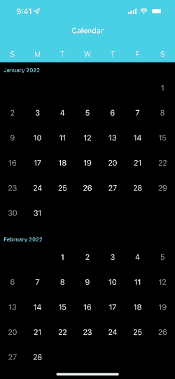

### Overview

This project is an ongoing experiment to recreate the interactions of the stock iOS Calendar app, using `UICollectionViewCompositionalLayout`. While I have tried not to cut corners and hardcode things, using `Calendar` APIs wherever possible, I would not recommend using this in production code without taking a long hard look at it first.

The basic calendar is constructed using a hierarchy of 4 types:
- `Timeline`
- `Year`
- `Month`
- `Day`

The `Timeline` acts as the data source of the calendar and holds a mutable `[Year]`. Starting at a given date, the `Timeline` will populate a period of time around that date to facilitate initial scrolling.

Each of these `Year`s has (predictably) an `[Month]`, calculated by iterating over `Calendar.range(of:in:for)`. These months, in turn, store the `firstDate` in that month, the weekday offset (using `Calendar.component(_:from:)`) and a `[Day]`. Each `Day` contains the `Date` it represents, the index in the month as well as a `Bool` that represents whether or not it is in the weekend.

### Infinite Scrolling

|  | 
|:--:| 
| *Infinite scrolling in action. Note: the frame rate is smoother and the image is sharper on an actual simulator / device* |

In order to infinitely scroll in either direction around a given date - the contents of the data source has to change. You can't just store a ridiculously large amount of dates in an array and hope for the best.

As the user scrolls, the collection view is monitoring that content offset. If the user reaches either the top or bottom of the content size, it triggers a data source update. If the user hits the top of the collection view, a new year is prepended to the data source, and any excess years in the other direction are removed. If the user reaches the bottom of the collection view, a new year is appended to the data source and any excess years earlier are removed to keep the data size small.

This modification logic is performed just before the collection view lays out it's subviews to ensure that visual glitches in the collection view do not occur. In addition, `contentOffset` is modified directly instead of using `setContentOffset(_:animated:)` to maintain existing scrolling velocity.
